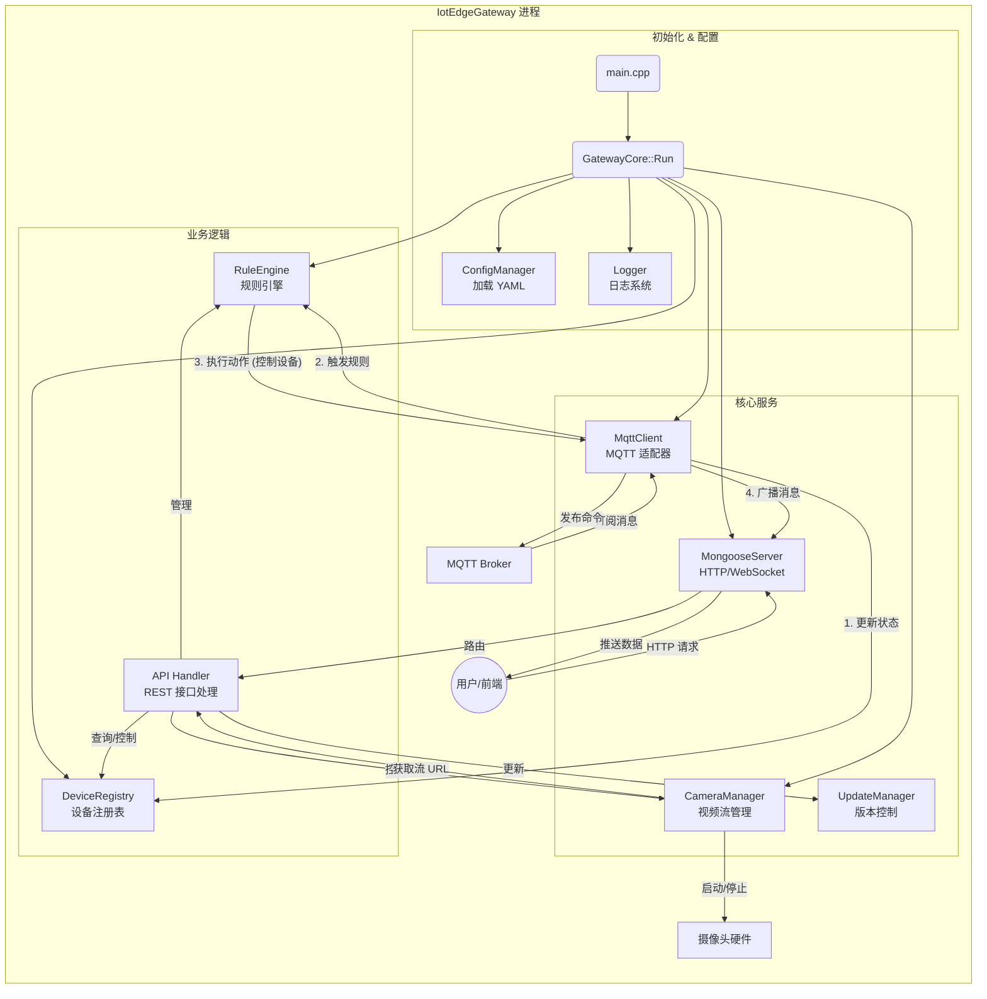

# 📊 项目完成度与差距分析报告 (Gap Analysis)

> **生成日期**: 2026-02-28
> **对标依据**: 系统架构图与原始需求文档

---

## 🎯 总体概览

| 模块 | 权重 | 完成度 | 状态 | 说明 |
| :--- | :---: | :---: | :---: | :--- |
| **基础架构** (Web/Config/Log) | 20% | 🟢 **95%** | ✅ 成熟 | Web Server、WebSocket、配置管理、日志系统已就绪。 |
| **设备管理** (Device Logic) | 15% | 🟢 **80%** | ✅ 可用 | 设备注册、状态维护、MQTT 状态同步逻辑已打通。 |
| **通信链路** (MQTT/Cloud) | 15% | 🟢 **90%** | ✅ 可用 | 通用 MQTT 客户端已实现，支持本地/云端连接。 |
| **视频流服务** (Video) | 20% | 🟢 **90%** | ✅ 已实现 | 后端进程管理与 API 已就绪，需运行时环境支持 `mjpg-streamer`。 |
| **数据存储** (SQLite) | 10% | 🔴 **0%** | ⚠️ 缺失 | 代码中无数据库相关实现，数据纯内存存储。 |
| **硬件协议** (Zigbee/Modbus) | 20% | 🟡 **10%** | 🚧 开发中 | 仅有类骨架，缺乏具体串口通信与协议解析实现。 |

---

## ✅ 已完成功能 (Completed)

### 1. 核心服务 (Core Services)
- **Web Server**: 基于 Mongoose 实现了 REST API (`/api/*`) 和静态文件服务。
- **WebSocket**: 实现了双向通信，支持实时数据广播与控制指令下发。
- **规则引擎**: 实现了基础的 `IF condition THEN action` 自动化逻辑。
- **视频流服务**: 实现了 `CameraManager` 管理外部 `mjpg-streamer` 进程，并提供 REST API 控制接口。

### 2. 设备管理 (Device Management)
- **注册表**: 支持从 `yaml` 配置文件加载设备定义。
- **状态同步**: 实现了设备在线状态、遥测数据 (`telemetry`) 的实时更新。

### 3. 工程化 (Engineering)
- **构建系统**: CMake 配置完善，支持 `x86_64` / `aarch64` 交叉编译。
- **脚本工具**: 提供了 `build.sh` 一键构建与清理脚本。

---

## 🚧 差距详解 (Gap Details)

### 1. 🎥 视频流媒体 (Video Streaming) - [P0 优先级]
> **需求**: 摄像头画面采集、HLS/MJPEG 推流、录像、拍照。

*   **现状**:
    *   后端已实现 `CameraManager`，支持启动/停止 `mjpg-streamer`。
    *   API 接口 (`/api/camera/start`, `/api/camera/stop`, `/api/camera/snapshot`) 已实现。
    *   **依赖**: 运行时环境（如 RK3568）需预装 `mjpg-streamer` 并在系统路径中可用。
*   **缺失工作**:
    *   前端页面对接 API（目前可能仅为静态 UI）。
    *   录像文件管理逻辑（目前仅支持实时流与快照）。

### 2. 💾 数据持久化 (Data Persistence) - [P1 优先级]
> **需求**: 历史数据存储、掉电不丢失。

*   **现状**:
    *   架构图设计了 `Data Center (SQLite)`。
    *   代码中 **无任何数据库引用**，所有状态仅保存在内存 `DeviceRegistry` 中。
*   **缺失工作**:
    *   引入 SQLite 依赖 (如 `sqlite_orm`)。
    *   设计数据库表结构 (devices, telemetry_log, alarms)。
    *   实现数据定期入库与查询 API。

### 3. 🔌 硬件协议适配 (Protocol Adapters) - [P1 优先级]
> **需求**: 接入 Zigbee 传感器与 Modbus PLC 设备。

*   **现状**:
    *   `ZigbeeAdapter`: 仅有空类，`Start()` 返回 `false`。
    *   `ModbusAdapter`: 仅有空类，未实现 RTU/TCP 通信。
*   **缺失工作**:
    *   **Zigbee**: 实现串口通信或对接 `zigbee2mqtt` 服务。
    *   **Modbus**: 集成 `libmodbus` 库，实现寄存器读写逻辑。

### 4. ☁️ 云端对接 (Cloud Integration) - [P2 优先级]
> **需求**: 阿里云 IoT 平台接入。

*   **现状**:
    *   通用 MQTT 客户端已实现，可连接阿里云 Broker。
    *   **缺少物模型封装**：阿里云要求特定的 Alink JSON 格式和 Topic 结构。
*   **缺失工作**:
    *   封装阿里云 Alink 协议消息生成器。
    *   实现云端指令解析与响应。

---

## 📅 下一步行动建议 (Action Plan)

1.  **Phase 1: 补齐视频能力** (✅ 已完成)
    *   在后端实现 `CameraManager` 类，通过 `fork/exec` 管理 `mjpg-streamer`。
    *   打通 `/api/camera` 接口。

2.  **Phase 2: 数据入库** (👉 进行中)
    *   集成 SQLite，确保持久化存储设备最新状态。

3.  **Phase 3: 硬件联调**
    *   完善 Modbus 实现，连接真实硬件或模拟器进行测试。

请帮我实现补齐这部分功能：***\*Phase 1: 补齐视频能力\****

在后端实现 `CameraManager` 类，通过 `fork/exec` 管理 `mjpg-streamer`。

打通 `/api/camera` 接口。

---

### 1. 项目结构分析

该项目采用了典型的 **分层架构**，主要分为以下几个模块：

*   **入口 (Gateway)**: `src/gateway/`，负责程序的启动、配置加载、组件初始化和主循环。
*   **核心 (Core)**:
    *   `common/`: 通用工具（日志、配置、JSON、时间）。
    *   `device/`: 设备管理（注册表、模型）和协议适配（MQTT, Modbus, Zigbee）。
    *   `control/`: 规则引擎，负责业务逻辑判断和自动化控制。
*   **服务 (Services)**:
    *   `web_services/`: 提供 HTTP API 和 WebSocket 接口，用于前端交互。
    *   `system_services/`: 系统级服务，如摄像头管理、版本更新、看门狗。

### 2. 系统架构流程图 (Mermaid)

这个流程图展示了系统从启动到运行时的主要模块交互关系：

### 3. 核心数据流说明

1.  **启动流程**:
    *   `main.cpp` 解析命令行参数。
    *   `GatewayCore` 加载 `config/` 下的 YAML 配置文件。
    *   初始化日志、数据库（设备注册表）、规则引擎。
    *   启动 Web 服务器（HTTP + WebSocket）。
    *   连接 MQTT Broker。

2.  **设备数据上行 (Sensor -> Gateway)**:
    *   传感器数据通过 MQTT 发送到 Broker。
    *   `MqttClient` 收到消息，解析 Payload。
    *   **更新状态**: 更新 `DeviceRegistry` 中的设备最后活跃时间和数值。
    *   **规则判断**: 将数据传入 `RuleEngine`，检查是否满足自动化规则（如：温度 > 30°C）。
    *   **触发动作**: 如果规则满足，生成动作（如：打开风扇），通过 `MqttClient` 发布控制指令。

3.  **用户控制流程 (User -> Gateway)**:
    *   **HTTP API**: 用户通过浏览器/App 发送 HTTP 请求（如 `/api/camera/start`）。
    *   `API Handler` 解析请求，调用 `CameraManager` 启动 `mjpg-streamer` 进程。
    *   **WebSocket**: 前端通过 WebSocket 监听实时数据，`Gateway` 会将收到的 MQTT 消息实时广播给前端。

---

